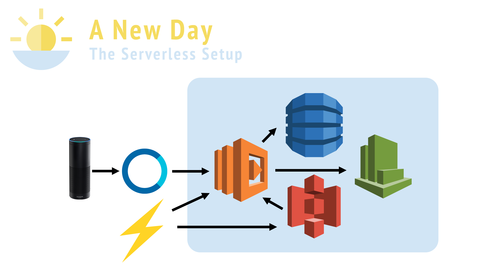

### *"Alexa, start a new day"*

Meet A New Day: An Alexa Skill which allows users to input their typical morning into our app.

With this information, A New Day guides you through your morning to keep you on track; because a successful morning sets the tone for a great day.

### The Tech

For this project I used to following technologies:
- Alexa Skills Kit
- AWS Lambda
- S3
- Serverless
- DynamoDB
- As well as: Babel, Nodemon, Express, BodyParser, Promises, Bluebird and more!

## The Goal

I sought out to create an Alexa Skill which was immersive. Mornings can be stressful morning because we all have a long list of tasks to do before we leave for school and work each day.

I imagined an app which allows users to input *their* typical morning along with their ideal timeline. The app reminds you to accomplish those tasks without the constant nagging of alarms. As the user is getting dressed, the app will inform them of the weather. Just before you walk out the door, a gentle reminder to grab your phone and wallet (or whatever you need reminding about). And that's it!

## The Challenge: No GUI, only audio
I love creating a frictionless frontend, but this app was purely an audio experience. I realized that I could create an audio UI and layer on sounds to guide the user through the experience.

[Start](https://s3.amazonaws.com/a-new-day/welcome.mp3)

[Good Morning, Crystal](https://s3.amazonaws.com/a-new-day/routine.mp3)

[Confirmation](https://s3.amazonaws.com/a-new-day/confirm.mp3)

[Error](https://s3.amazonaws.com/a-new-day/error.mp3)
